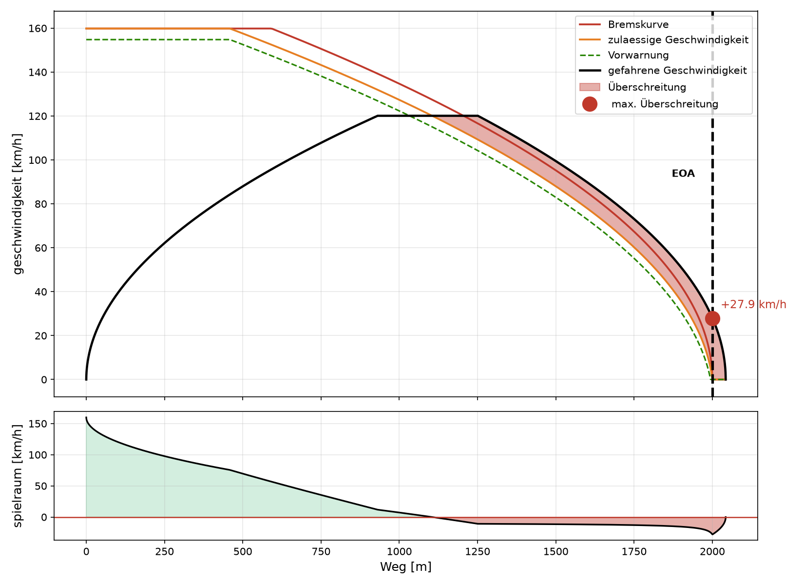

# Geschwindigkeitsüberwachung

Ich wollte mich in Testautomatisierung mit Python einarbeiten und dafür etwas bauen,
das nicht nur aus Übungsaufgaben besteht. Herausgekommen ist ein kleines Werkzeug,
das eine Zugfahrt gegen Überwachungskurven prüft.

Die Idee: Ein Zug fährt auf das Ende seiner Fahrterlaubnis (EOA) zu. Aus dem
Bremsvermögen und einer Reaktionszeit ergibt sich, wie schnell er an welcher Stelle
noch sein darf. Das Skript rechnet diese Kurven aus, vergleicht sie mit einer
aufgezeichneten Fahrt und meldet jede Überschreitung mit Ort und Betrag.

Das Modell ist stark vereinfacht und bildet **nicht** die echten ETCS-Bremskurven
nach Subset-026 ab. Mir ging es um die Methodik, nicht um Normtreue.



## Ausführen

```bash
python -m unittest -v              # Tests
python plot_run.py                 # bremst zu spät  -> FAIL
python plot_run.py --brake-at 500  # rechtzeitig     -> PASS
python plot_run.py --help          # alle Optionen
```

Das Skript gibt einen Textreport aus, speichert die Grafik und liefert Exit-Code 1,
wenn es Verletzungen gefunden hat. Damit kann man es ohne Änderung in einen
automatisierten Testlauf hängen.

## Dateien

- `etcs_supervision.py` — Kurven, Verletzungserkennung, Fahrtsimulation, CSV
- `test_etcs_supervision.py` — die Tests
- `plot_run.py` — Auswertung, Report, Grafik

## Wie die Kurven zustande kommen

Bremskurve, also die Geschwindigkeit, aus der man genau am EOA zum Stehen kommt:

```
v = sqrt(2 * a * (EOA - s))
```

Bei der zulässigen Geschwindigkeit kommt die Reaktionszeit `T` dazu. In dieser Zeit
fährt der Zug noch ungebremst weiter, legt also `v*T` zurück, und erst danach greift
die Bremse:

```
v = sqrt(2 * a * (EOA - s - v*T))
```

Quadrieren und umstellen ergibt `v² + 2aT·v - 2a(EOA - s) = 0`, und die positive
Lösung davon ist:

```
v = -a*T + sqrt((a*T)² + 2*a*(EOA - s))
```

Die Vorwarnkurve liegt noch einmal einen festen Betrag darunter. Alle drei Kurven
werden zusätzlich durch die Streckenhöchstgeschwindigkeit gedeckelt.

## Zu den Tests

Neben den offensichtlichen Fällen habe ich vor allem auf die Ränder geachtet: genau
am EOA, hinter dem EOA, Geschwindigkeit exakt auf der Grenze, und eine Verletzung,
die bis zum letzten Messpunkt läuft.

Zwei Tests prüfen keine festen Werte, sondern Eigenschaften. Einer nimmt die
berechnete zulässige Geschwindigkeit und simuliert von dort aus vorwärts:
Reaktionszeit abwarten, bremsen, und der Zug muss vor dem EOA stehen. Der Test
benutzt die Formel selbst nicht, also fällt eine falsche Herleitung auf. Der andere
prüft über den gesamten Weg, dass Vorwarnung ≤ zulässig ≤ Bremskurve gilt.

Dazu kommen Ende-zu-Ende-Tests: eine zu spät bremsende Fahrt muss erkannt werden,
eine rechtzeitig bremsende darf keinen Fehlalarm auslösen. Der zweite Teil ist mir
wichtiger, denn ein Werkzeug mit Fehlalarmen wird nach kurzer Zeit ignoriert.


## Was noch fehlt

- Steigungen und wechselnde Streckenhöchstgeschwindigkeiten
- echte Aufzeichnungsformate statt CSV einlesen
- die wiederholten Testfälle über `subTest` parametrisieren


## Browser-Tests

Selenium hatte ich vorher nicht benutzt, deshalb ist hier zusätzlich ein kleiner
Browser-Test gegen die offizielle Übungsseite von Selenium. Er läuft über dasselbe
`unittest` wie die Fachlogik.

- `web_form_page.py` — Page Object: alle Locator an einer Stelle, Waits in den Methoden
- `test_web_form.py` — der Test

```bash
python -m unittest test_web_form        # headless
HEADLESS=0 python -m unittest test_web_form   # mit sichtbarem Browser
```

Statt `sleep` überall explizite Waits, weil Timing die häufigste Ursache für
instabile Browser-Tests ist. `sleep` habe ich trotzdem nur für Sichtbarkeit des Verfahrens
